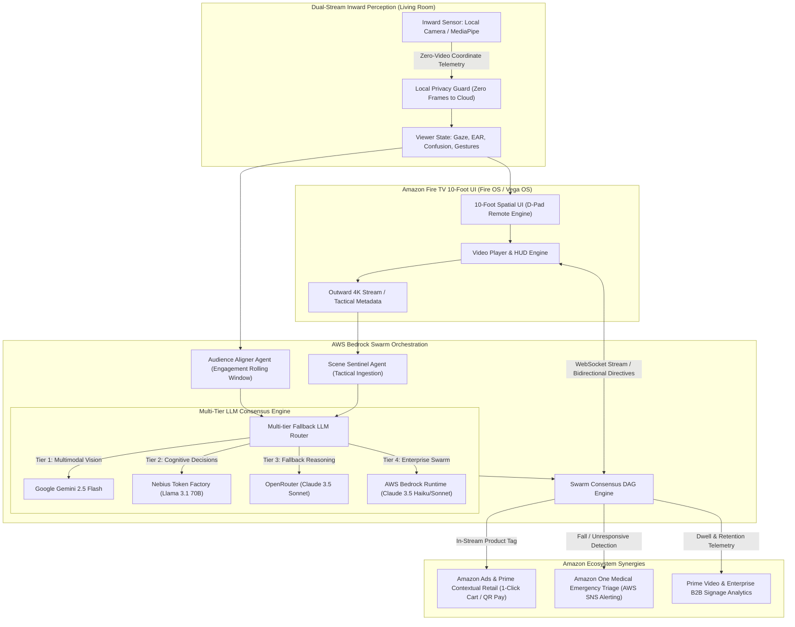

# SynapseTV Architecture & Technical Specification

## 1. System Overview

**SynapseTV** is an Autonomous Living-Room Cognitive Hub & Spatial Co-Viewer engineered specifically for Amazon Fire TV (Fire OS / Vega OS) and AWS Bedrock. 

Traditional smart TV interfaces are passive: when a viewer falls asleep, steps away to take a phone call, or gets confused by complex on-screen tactics or narrative plot twists, the TV continues playing blindly. SynapseTV turns the living room screen into an empathetic, intelligent companion using **dual-stream perception** and a **multi-agent consensus swarm**.

---

## 2. High-Level System Architecture



### Comprehensive ASCII Architecture Flow

```
[Inward Sensor: Local MediaPipe] 
       │ 
       ▼ (Zero-Video Coordinate Telemetry)
[10-Foot Spatial UI: D-Pad Nav] ◄══════════════════════════════════════════► [Amazon Ads / Contextual Retail]
       │                                                                               ▲
       ▼ (Bidirectional WebSocket Telemetry & Directives)                              │
[AWS Bedrock Swarm: Multi-tier Router] ────────────────────────────────────────────────┴─► [Amazon One Medical Triage]
       │ (Tier 1: Gemini | Tier 2: Nebius Llama | Tier 3: OpenRouter | Tier 4: Bedrock)
       ▼
[Autonomous Adaptations: Auto-Pause, Smart Bookmark, Tactical Micro-Explainer]
```

---

## 3. Dual-Stream Perception Model

### A. Inward Perception (The Viewer)
* **Gaze Tracking & Eye Aspect Ratio (EAR):** Detects micro-blinks, prolonged eyelid closure ($t > 2.0\text{s}$), and off-screen visual distraction ($t > 3.5\text{s}$).
* **Cognitive Tension & Confusion:** Monitors brow furrowing and head tilt metrics to infer narrative disorientation during complex sports tactics or intricate plot developments.
* **Spatial Hand Gestures:** Lightweight geometric vector model computing 21 landmarks:
  - **Open Palm:** Immediate zero-touch mute or pause.
  - **Horizontal Swipe Right / Left:** $+30\text{s}$ skip / $-15\text{s}$ rewind.
  - **Two-Finger Pinch:** Spatial dynamic zoom into tactical formations or details.
  - **Thumbs Up:** Instant timestamped Smart Bookmark creation.

### B. Outward Perception (The Screen)
* **Real-time Scene Metadata:** Temporal video frame indexing matching tactical shifts, player formations, and narrative arcs.
* **Dynamic Audio Profile:** Real-time tracking of dialogue-to-ambient noise ratios (e.g. "Crowd Roar" vs "Subtle Dialogue"), dynamically boosting voice clarity when ambient noise spikes.

---

## 4. AWS Bedrock Swarm Multi-Agent Consensus

The backend coordinates three specialized agents through a Directed Acyclic Graph (DAG) state machine:

1. **Scene Sentinel (`scene_sentinel.py`):**
   - Continuously inspects outward video metadata.
   - Computes scene complexity scores ($0.0 \to 1.0$) and identifies tactical triggers (e.g., transition from 4-2-3-1 to 3-2-4-1 inverted fullback overload).
   - Generates structured prompts for Claude 3.5 Haiku when micro-explainers are requested.

2. **Audience Aligner (`audience_aligner.py`):**
   - Ingests incoming 60 FPS viewer telemetry.
   - Computes rolling engagement window and tracks consecutive disengaged frames.
   - Signals `should_auto_pause`, `should_auto_resume`, or `should_trigger_clarification`.

3. **Swarm Orchestrator (`swarm_orchestrator.py`):**
   - Resolves conflicts between outward and inward agents.
   - **Precedence Rule 1 (Safety/Comfort):** Zero-touch physical gestures override all other actions.
   - **Precedence Rule 2 (Empathy):** If the viewer is sleeping or absent, suppress all explanatory popups, auto-pause video playback, and bookmark the exact frame timestamp.
   - **Precedence Rule 3 (Contextual Assistance):** When the viewer is confused AND scene complexity is high, invoke AWS Bedrock to synthesize a high-contrast micro-explainer.

---

## 5. 10-Foot Spatial UI & Remote Engine

SynapseTV strictly adheres to Amazon Fire TV 10-foot design guidelines:
- **Spatial Focus Traversal:** Custom geometric distance navigation (`SpatialDpadNav.tsx`) ensuring deterministic remote traversal across cards, buttons, and popups.
- **Hardware KeyCode Normalization:** Normalizes Fire OS hardware keycodes (`19, 20, 21, 22, 23, 4, 179`) and standard browser keyboard events.
- **Cognitive Typography & Contrast:** Sized for 10-foot readability (large headers, glowing amber/cyan focus rings, glass-morphism panels that do not occlude prime action).

---

## 6. AWS Production Deployment Architecture

```
                  ┌────────────────────────────────────────────────────────┐
                  │                 AWS CLOUDFRONT / S3                    │
                  │             Static Fire TV Web Application             │
                  └───────────────────────────┬────────────────────────────┘
                                              │
                                              ▼
┌──────────────────────────────────────────────────────────────────────────────────┐
│                             AWS APPLICATION LOAD BALANCER                        │
└─────────────────────────────────────┬────────────────────────────────────────────┘
                                      │
                   ┌──────────────────┴──────────────────┐
                   ▼                                     ▼
┌──────────────────────────────────────┐     ┌─────────────────────────────────────┐
│       FASTAPI ON ECS FARGATE         │     │         AWS BEDROCK RUNTIME         │
│  - WebSocket & SSE streaming hub     │◄───►│  - Anthropic Claude 3.5 Haiku       │
│  - Swarm Orchestrator DAG state      │     │  - Anthropic Claude 3.5 Sonnet      │
└──────────────────┬───────────────────┘     └─────────────────────────────────────┘
                   │
                   ▼
┌──────────────────────────────────────┐
│           AMAZON DYNAMODB            │
│  - Persistent Smart Bookmarks        │
│  - Viewer Persona & History          │
└──────────────────────────────────────┘
```
